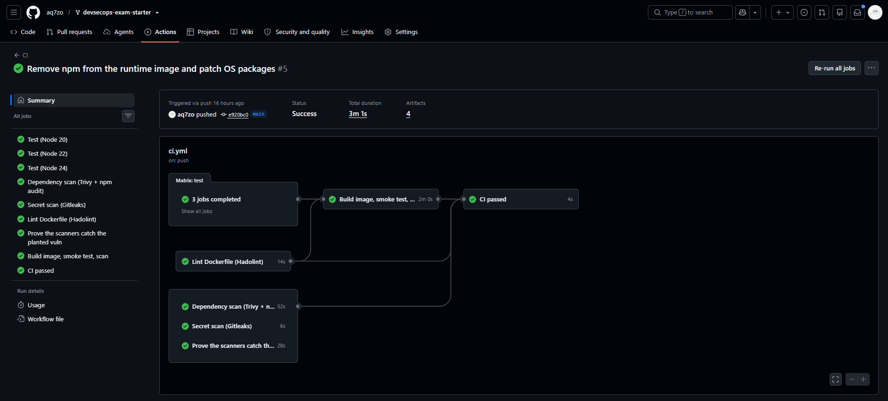
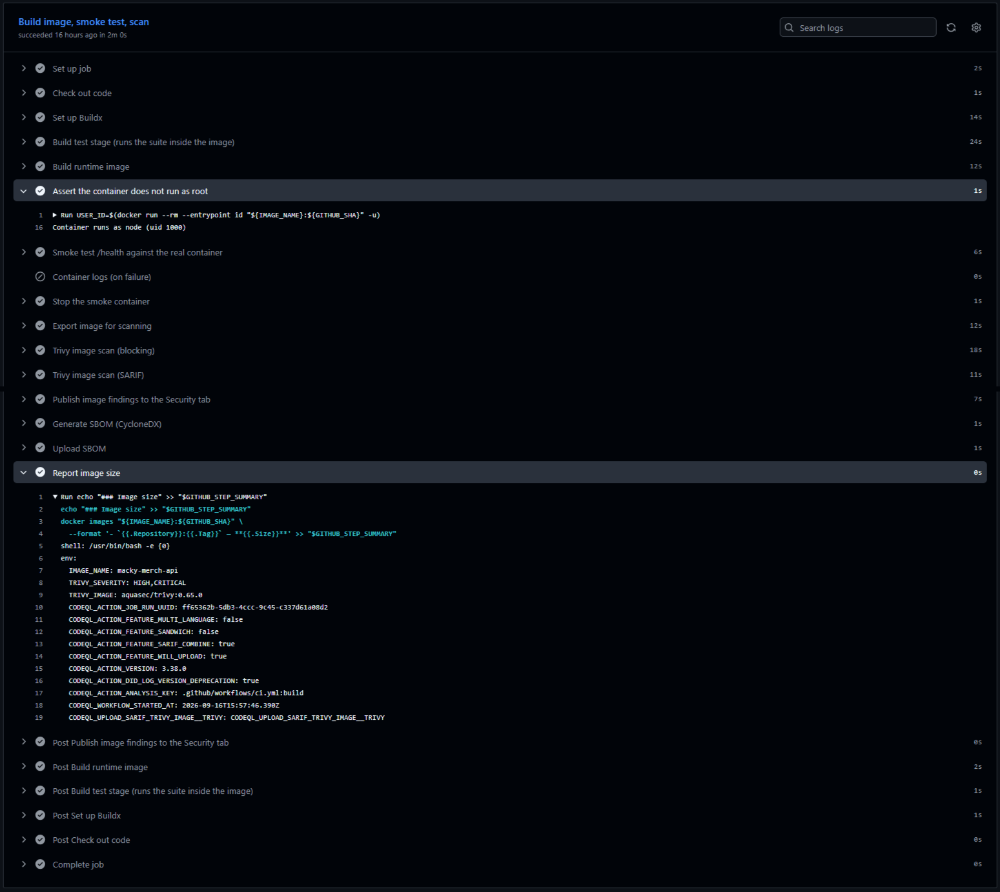
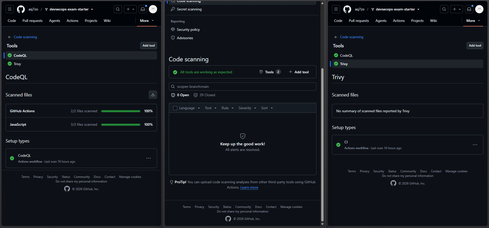
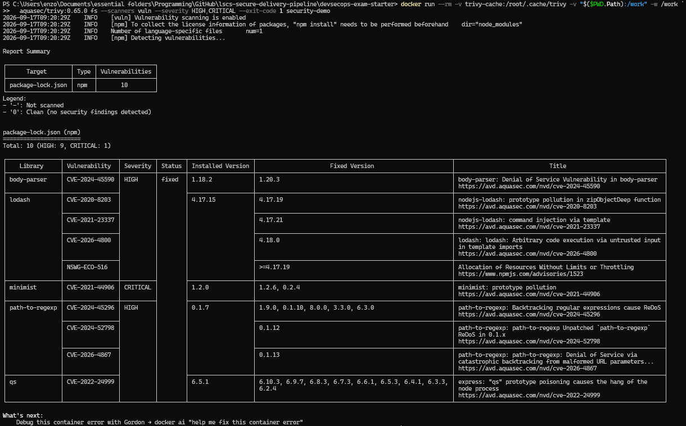
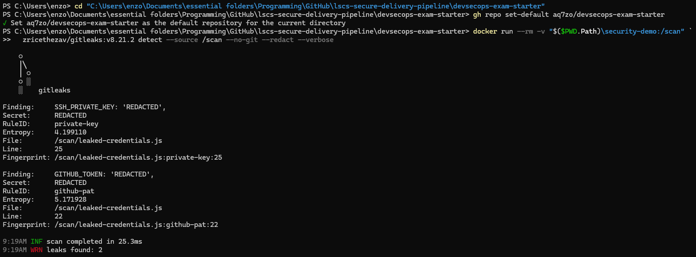
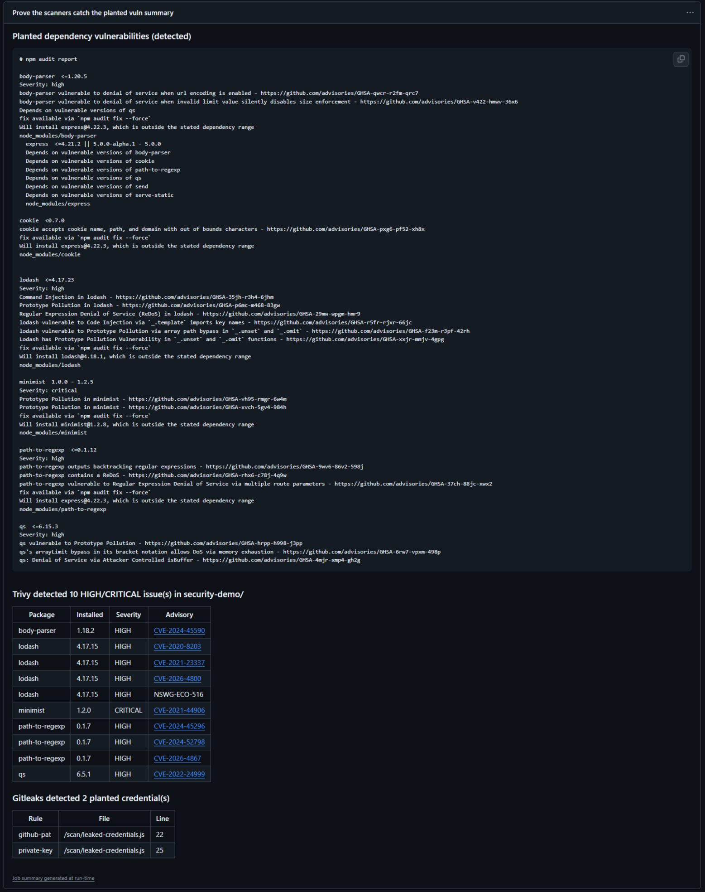
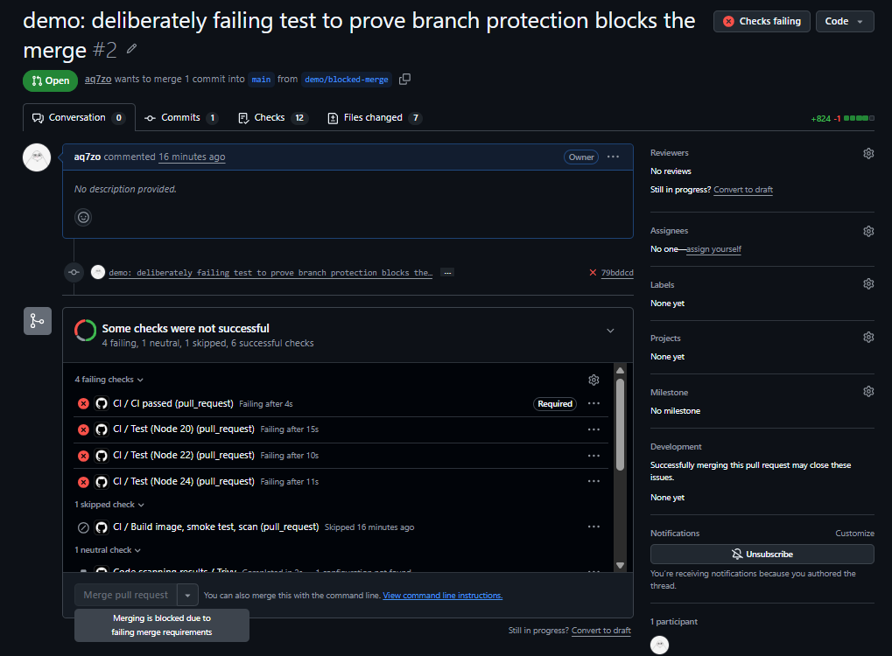

# Macky Merch API — Secure Delivery Pipeline

> LSCS DevSecOps Engineering Take-Home Exam · 41st LSCS · Term 1

The baseline Express API from the starter repo, containerised and wrapped in a
CI/CD pipeline that tests it, builds it, proves the container actually serves
traffic, and blocks the merge when a security scanner finds something.

- [Setup](#setup)
- [Verify everything at once](#verify-everything-at-once)
- [Pipeline](#pipeline)
- [Why `node:22-alpine`](#why-node22-alpine)
- [Why these scanners](#why-these-scanners)
- [Vulnerability demonstration](#vulnerability-demonstration)
- [Challenge faced](#challenge-faced)
- [Bonus features](#bonus-features)

## Setup

```bash
docker build -t macky-merch-api:local .
docker run --rm --init -p 3000:3000 macky-merch-api:local

curl http://localhost:3000/health
# {"status":"OK","message":"Macky Merch API is running smoothly."}
```

Confirm it is **not** running as root:

```bash
docker run --rm --entrypoint id macky-merch-api:local -un
# node
```

Full stack (API + Redis on a private network), and without Docker:

```bash
docker compose up --build
docker compose down -v

npm ci && npm start     # npm ci, not npm install — see Challenge
npm test
```

> [!NOTE]
> `--init` gives the container a real PID 1, so `Ctrl-C` and `docker stop`
> return immediately instead of waiting out the 10-second kill timeout.
> Compose sets `init: true` for the same reason.

## Verify everything at once

`scripts/verify.sh` runs every item on the exam's submission checklist locally —
the same assertions CI makes, before you push:

```bash
npm run verify          # everything, including the image build and smoke test
npm run verify:fast     # static checks only, no Docker (~5s)
```

```
4. Security scanning
  PASS  Security scanner integrated: Trivy secret scanner CodeQL npm audit
  PASS  Deliberate vulnerability planted (security-demo/)
  PASS  npm audit flags the planted dependencies (5 high/critical advisories)
  PASS  Gitleaks flags the planted credentials
  PASS  Fixture excluded from the image (.dockerignore)

Summary
  33 passed · 0 failed · 6 skipped · 0 bonus missing
```

It exits non-zero if any **required** check fails; bonus items report as `MISS`
without failing the run, and anything needing a missing tool reports `SKIP`
rather than passing silently. The scanner checks are inverted the same way CI's
are — a scanner that finds *nothing* in `security-demo/` is a **FAIL**, because
that result is indistinguishable from a broken one.

## Pipeline

`.github/workflows/ci.yml`, on every push and pull request to `main`:

```
├── test              Node 20 · 22 · 24  →  npm ci  →  npm test
├── dependency-scan   npm audit (gate: high+)  +  Trivy fs
├── secret-scan       Gitleaks over the FULL git history
├── lint-dockerfile   Hadolint
├── vulnerability-demo  INVERTED gate — fails if the scanners find nothing
│
└── build   (needs: test, lint-dockerfile)
      ├── build image (test stage runs the suite inside the container)
      ├── assert uid != 0, then run it and poll /health until 200
      └── Trivy image scan → gate at HIGH/CRITICAL
```



**`build` runs the container, not just `docker build`.** A Dockerfile can build
cleanly and still produce an image that exits on startup — wrong `CMD`, a prod
dependency pruned by `--omit=dev`, a file the `node` user cannot read. So "the
image builds" and "the image works" are checked separately.

## Why `node:22-alpine`

**Not `node:latest`** — it is not a version, it is a moving target. The image
CI builds today and the one a reviewer builds next month can be different Node
majors, which defeats the point of a lockfile: reproducible dependencies on an
irreproducible runtime. It is also the largest variant, shipping a full Debian
userland this app never uses.

**Not `node:22` (Debian)** — ~1.1 GB uncompressed versus ~150 MB for Alpine.
Size here is attack surface: every OS package is one Trivy can find a CVE in
and one you then have to triage, and `curl`, `git`, `perl` and a compiler in a
production image are tools an attacker inherits for free after an RCE.

**Why 22** — Active LTS. `package.json` declares `"engines": { "node": ">=20" }`
and CI tests 20, 22 and 24, so the pin is tested rather than assumed.

> [!IMPORTANT]
> The trade-off: Alpine uses musl libc, not glibc, so packages with prebuilt
> native bindings may fall back to compiling from source or misbehave subtly.
> This app is pure JavaScript, so the trade is free — on a project with native
> modules, `node:22-slim` (~200 MB) is the better answer.

**Non-root** is enforced, not just written down. `USER node` uses the uid 1000
account the official image already provides, and CI fails the build if
`docker run --entrypoint id` returns `0` — so an edit that drops that line
breaks CI instead of quietly shipping a root container.



*The assertion reads the running container (`Container runs as node (uid 1000)`),
not the Dockerfile — appending `USER root` further down would pass a text check
and fail this one.*

The build is **multi-stage**: `deps` (`npm ci --omit=dev`), `test` (full tree,
suite runs during the image build), `runtime` (app + production modules only).
The final image carries no `jest`, no npm cache — and no package manager at
all, since the container runs `node server.js` and installs nothing at run
time. That deletion alone removed 11 of the image scan's 13 findings.

**`.dockerignore`** keeps `node_modules` (a host-built tree carries the wrong
platform's native binaries), the `security-demo/` fixture, and `.git` out of
the build context. `.git` is the security-relevant one: its config and logs
routinely contain credentials, and anything copied into a layer stays there
forever — deleting it in a later `RUN` hides it from `ls`, nothing more.

## Why these scanners

The spec asks for **at least one**. This pipeline runs one from each of the
three classes, because they cannot substitute for each other.

| Scanner | Class | Finds | Cannot find |
|---|---|---|---|
| **Trivy** | SCA + image | Known CVEs in npm packages *and* Alpine base-image packages | Bugs with no published advisory |
| **Gitleaks** | Secret detection | Credentials in the working tree **and in git history** | Anything that is not a credential |
| **CodeQL** | SAST | Flaws in code we wrote — injection sinks, unsafe flows | Vulnerable third-party dependencies |

**Trivy over `npm audit` alone.** `npm audit` is in the pipeline too, as a
second opinion from a different advisory source, but it only ever sees
`package-lock.json`. Trivy scans the **built image**, where the Alpine packages
live, and emits SARIF that lands in the GitHub Security tab instead of
scrolling past in a log. `--ignore-unfixed` on the blocking scans is
deliberate: blocking a merge on a CVE with no available patch leaves the
developer no action except disabling the gate, which is how security checks die.

**Gitleaks over TruffleHog.** TruffleHog's default mode reports only *verified*
secrets — it calls the provider to check the credential is live. Exactly wrong
here: the planted credentials are fake and would never verify, so the demo
would report clean. Gitleaks flags anything shaped like a credential, which is
also what you want in a pre-merge gate, where the point is catching a key
*before* it goes live. It runs with `fetch-depth: 0`, since the default shallow
clone would pass a secret that was committed Monday and deleted Tuesday.



*Both SARIF-emitting scanners register as tools in the Security tab, so findings
get history and per-PR annotations instead of scrolling past in a log — 0 open
alerts on `main`, 39 resolved.*

## Vulnerability demonstration

Planted in [`security-demo/`](./security-demo/):

| File | Planted | Detected by |
|---|---|---|
| `package.json` | `lodash@4.17.15`, `express@4.16.0`, `minimist@1.2.0` | Trivy, `npm audit` |
| `leaked-credentials.js` | Fake GitHub PAT and RSA private key | Gitleaks |

CI confirms **10 HIGH/CRITICAL dependency findings and 2 detected
credentials** — headline `minimist@1.2.0`, **CVE-2021-44906 (CRITICAL,
prototype pollution)**, alongside HIGH advisories in `lodash`,
`path-to-regexp`, `qs` and `body-parser`. Reproduce locally:

```bash
cd security-demo && npm audit --audit-level=high

docker run --rm -v "$PWD:/work" -w /work aquasec/trivy:0.65.0 \
  fs --scanners vuln --severity HIGH,CRITICAL security-demo

docker run --rm -v "$PWD/security-demo:/scan" zricethezav/gitleaks:v8.21.2 \
  detect --source /scan --no-git --redact --verbose
```



*Trivy: `Total: 10 (HIGH: 9, CRITICAL: 1)` — `minimist` CVE-2021-44906 is the
critical one, and every row carries a fixed version, so none are suppressed by
`--ignore-unfixed`.*



*Gitleaks: `leaks found: 2` — `private-key` at line 25 and `github-pat` at line
22, printed with `--redact`.*

> [!NOTE]
> Both commands pin the scanner version the pipeline uses. Upstream tightened
> the `github-pat` rule after v8.21.2, so `gitleaks:latest` finds one fewer
> credential in this fixture than CI does.

CI writes the same evidence to the **workflow run summary** as rendered tables,
so the proof is on the run page rather than buried in step logs:



*The `Prove the scanners catch the planted vuln` job's summary: the raw
`npm audit` report, `Trivy detected 10 HIGH/CRITICAL issue(s) in security-demo/`,
and `Gitleaks detected 2 planted credential(s)` with rule, file and line.*

Capture steps for these screenshots:
[`docs/screenshots/README.md`](./docs/screenshots/README.md).

The fixture is deliberately **outside** the app's dependency graph and outside
the image, and the `vulnerability-demo` job treats it as an *inverted gate* —
it fails if the scanners come back clean:

```yaml
- name: npm audit MUST flag the planted dependencies
  run: |
    npm audit --audit-level=high | tee audit.txt
    if [ "${PIPESTATUS[0]}" -eq 0 ]; then
      echo "::error::npm audit found nothing. The gate is broken."
      exit 1
    fi
```

The reasoning is in [Challenge faced](#challenge-faced). The production gates
(`dependency-scan`, `secret-scan`, the image scan) are ordinary blocking checks
that skip this directory, so a real leak can never hide behind a planted one.

> [!NOTE]
> The application's own dependencies are clean: `npm audit` at the repository
> root reports **0 vulnerabilities**.

## Challenge faced

The spec asks for two things that pull in opposite directions. Requirement 4
wants a deliberate vulnerability the pipeline *catches* — a failing check. The
branch-protection bonus wants a required check that *passes* on good code. Do
the obvious thing for both and `main` is permanently red, so branch protection
has to be bypassed on every merge.

My first attempt was `continue-on-error: true` on the scanning job. It "worked"
— vulnerability visible, pipeline green — but re-reading the job showed why it
was wrong: `continue-on-error` makes the step green *whatever* it reports. A
scanner finding ten CVEs and a scanner that crashed on startup produce an
identical green tick. That is exactly the security theatre the exam is testing
against.

The fix was inverting the assertion: not "run the scanner and tolerate
failure", but "run the scanner and **fail if it reports nothing**". Same green
pipeline, opposite guarantee — if a scanner breaks, the build breaks. Isolating
the fixture in `security-demo/` is what makes that possible without shipping a
vulnerable app.

The lesson: *a check that cannot fail is not a check.* Before trusting any
gate, ask what it does when the tool underneath it is broken, not just when the
code is bad.

## Bonus features

**Docker Compose** — `docker-compose.yml` runs the API and Redis on a private
user-defined `backend` network. Redis has **no `ports:` mapping**: reachable at
`redis://cache:6379` from inside the network, unreachable from the host, which
is the actual reason to define a network instead of using the default bridge.
`depends_on.condition: service_healthy` waits for Redis to answer `PING`, not
merely for the container to exist.

**Multi-stage build** — three stages, [described above](#why-node22-alpine).

**Branch protection** — applied via
[`scripts/setup-branch-protection.sh`](./scripts/setup-branch-protection.sh),
a script rather than a click-path because branch protection is repository
*state*, not code, and configuring it by hand leaves no record of what was set
or why. It requires the `ci-passed` check plus `strict: true` (a PR must be
current with `main`, which is what stops two individually-green PRs merging
into a broken main), `enforce_admins`, linear history and no force-pushes —
the last of which also stops someone erasing a committed secret from history
instead of rotating it.



*Proven rather than asserted: PR #2 deliberately breaks a test, the required
`CI / CI passed` check goes red, and the merge button is disabled with
"Merging is blocked due to failing merge requirements". Note `Build image, smoke
test, scan` is **skipped** — it needs `test`, and a skipped job is why the gate
is the single `ci-passed` job rather than each job individually.*

Also present, beyond the spec: a CycloneDX SBOM per build, SARIF upload to the
Security tab, Hadolint gating the Dockerfile, Dependabot for npm / base image /
Actions, and least-privilege workflow `permissions:`.
