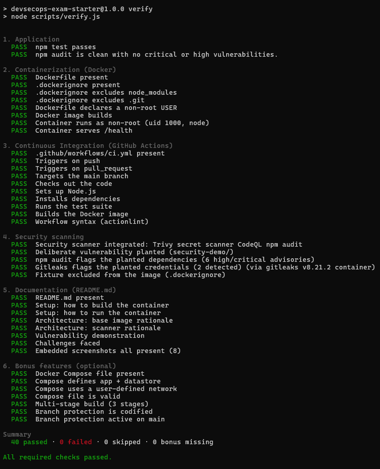

# Macky Merch API: Secure Delivery Pipeline

> LSCS DevSecOps Engineering Take-Home Exam · 41st LSCS · Term 1

The baseline Express API from the starter repo, containerised and wrapped in a
CI/CD pipeline that tests it, builds it, proves the container actually serves
traffic, and blocks the merge when a security scanner finds something.

- [Setup](#setup)
- [Verify everything at once](#verify-everything-at-once)
- [Pipeline](#pipeline)
- [Why `node:24-alpine`](#why-node24-alpine)
- [Why these scanners](#why-these-scanners)
- [Vulnerability demonstration](#vulnerability-demonstration)
- [Challenge faced](#challenge-faced)
- [Bonus features](#bonus-features)

## Setup

```bash
make run        # builds the image, then serves on :3000

curl http://localhost:3000/health
# {"status":"OK","message":"Macky Merch API is running smoothly."}
```

Confirm it is **not** running as root:

```bash
make whoami
# node
```

To run the full stack (API + Redis on a private network), or to run without Docker:

```bash
make up                 # docker compose up --build
make down               # docker compose down -v

npm ci && npm start     # npm ci, not npm install (see Challenge faced)
make test
```

### Make commands

| Command | Runs | What it does |
|---|---|---|
| `make build` | `docker build -t $(IMAGE) .` | Builds the image (default tag `macky-merch-api:local`; override with `make build IMAGE=…`) |
| `make run` | `docker run --rm --init -p 3000:3000 $(IMAGE)` | Builds, then serves the API on `:3000`. `--init` makes `Ctrl-C` stop it instantly |
| `make whoami` | `docker run --rm --entrypoint id $(IMAGE) -un` | Builds, then prints the container's user. Must print `node`, never `root` |
| `make up` | `docker compose up --build` | Starts the full stack: API + Redis on a private network |
| `make down` | `docker compose down -v` | Stops the stack and deletes its volumes |
| `make test` | `npm ci` then `npm test` | Installs the locked dependency tree and runs the Jest suite on the host |
| `make verify` | `npm run verify` | Runs every submission-checklist check, including the image build and smoke test |
| `make verify-fast` | `npm run verify:fast` | Static checks only, no Docker (~5s) |
| `make demo` | the three `demo-*` targets below | Runs every scanner against the planted fixture in `security-demo/` |
| `make demo-audit` | `cd security-demo && npm audit --audit-level=high` | `npm audit` on the planted packages. Expect 6 high/critical advisories |
| `make demo-trivy` | `docker run … aquasec/trivy:0.65.0 fs … security-demo` | Trivy on the planted packages. Expect 10 HIGH/CRITICAL findings |
| `make demo-gitleaks` | `docker run … zricethezav/gitleaks:v8.21.2 detect …` | Gitleaks on the planted credentials. Expect 2 leaks |

No `make` (e.g. stock Windows)? Run the command in the **Runs** column directly.

> [!NOTE]
> `--init` gives the container a real PID 1, so `Ctrl-C` and `docker stop`
> return immediately instead of waiting out the 10-second kill timeout.
> Compose sets `init: true` for the same reason.

## Verify everything at once

`scripts/verify.sh` (launched via `scripts/verify.js`, so it works on Windows too)
runs every item on the exam's submission checklist locally, making the same
assertions CI makes before you push:

```bash
make verify             # everything, including the image build and smoke test
make verify-fast        # static checks only, no Docker (~5s)
```



*A full `npm run verify` on this branch: every checklist section green,
40 passed · 0 failed · 0 skipped.*

Any **required** check failing makes it exit non-zero. Bonus items just show
up as `MISS` without failing the run, and if a tool a check needs is missing,
that check reports `SKIP` instead of quietly passing, which would be worse
than not checking at all. The scanner checks got the same inverted logic as
CI: a scanner that finds *nothing* in `security-demo/` counts as a **FAIL**,
because that result looks exactly like a broken scanner.

## Pipeline

`.github/workflows/ci.yml`, on every push and pull request to `main`:

```
├── test              Node 24  →  npm ci  →  npm test
├── dependency-scan   npm audit (gate: high+)  +  Trivy fs
├── secret-scan       Gitleaks over the FULL git history
├── lint-dockerfile   Hadolint (Dockerfile best-practices linter)
├── vulnerability-demo  INVERTED gate: fails if the scanners find nothing
│
└── build   (needs: test, lint-dockerfile)
      ├── build image (test stage runs the suite inside the container)
      ├── assert uid != 0, then run it and poll /health until 200
      └── Trivy image scan → gate at HIGH/CRITICAL
```


**Why `build` actually runs the container instead of stopping at `docker build`.**
A Dockerfile can build clean and still ship an image that dies on startup,
maybe the `CMD` is wrong, or `--omit=dev` pruned something the app needed at
runtime, or there's a file the `node` user can't read. So "the image builds"
and "the image works" get checked as two separate things, because they're not
the same claim.

## Why `node:24-alpine`

**Why not `node:latest`?** "latest" isn't a fixed version; it will always point to whatever the newest Node release is. So if I built the image today and someone else builds it next month, they could end up with a completely different version of Node. That undermines the existence of the lockfile, which exists to make sure everyone gets the exact same dependencies. On top of that, latest is the biggest image, and it would overkill to be bundling a full Debian operating system full of tools the app will never ever even use.

**Why Not `node:24` (the standard Debian version).** it pins the version, which fixes the first problem, but it's still huge, about 1.1 GB compared to only roughly ~150 MB for Alpine. The actual concern here isn't disk space, it's how many packages come with the version. Every extra package is something a security scanner, such as Trivy, might flag with a CVE, meaning more alerts to investigate. In short, I chose to keep the image minimal so there's a narrower attack surface for a
potential threat actor and consequently lesser dependencies to patch.

> [!IMPORTANT]
> The trade-off: Alpine uses musl libc, not glibc, so packages with prebuilt
> native bindings may fall back to compiling from source or misbehave subtly.
> This app is pure JavaScript, so the trade is free. On a project with native
> modules, `node:24-slim` (~200 MB) is the better answer.

**Non-root** is enforced, not just written down. `USER node` uses the uid 1000
account the official image already provides, and CI fails the build if
`docker run --entrypoint id` returns `0`, so an edit that drops that line
breaks CI instead of quietly shipping a root container.


*The assertion reads the running container (`Container runs as node (uid 1000)`),
not the Dockerfile. Appending `USER root` further down would pass a text check
and fail this one.*

The build is **multi-stage**: `deps` (`npm ci --omit=dev`), `test` (full tree,
runs the suite; CI builds it explicitly, while a plain `docker build` skips it
because `runtime` does not depend on it), `runtime` (app + production modules only).
The final image carries no `jest`, no npm cache and, since the container runs
`node server.js` and installs nothing at run time, no npm, npx, corepack or yarn.
Only Alpine's `apk` remains. Deleting the Node package managers alone removed 11 of the image scan's 13 findings.

**`.dockerignore`** keeps `node_modules` (a host-built tree carries the wrong
platform's native binaries), the `security-demo/` fixture, and `.git` out of
the build context. `.git` is the security-relevant one: its config and logs
routinely contain credentials, and anything copied into a layer stays there
forever; deleting it in a later `RUN` hides it from `ls`, nothing more.

## Why these scanners

The spec asks for **at least one**. This pipeline runs one from each of the
three classes, because they cannot substitute for each other.

| Scanner | Class | Finds | Cannot find |
|---|---|---|---|
| **Trivy** | SCA + image | Known CVEs in npm packages *and* Alpine base-image packages | Bugs with no published advisory |
| **Gitleaks** | Secret detection | Credentials in the working tree **and in git history** | Anything that is not a credential |
| **CodeQL** | SAST | Flaws in code we wrote, such as injection sinks and unsafe flows | Vulnerable third-party dependencies |

**Why Trivy and not just `npm audit`?** `npm audit` is still in the pipeline,
it's a second opinion from a different advisory source, but it only ever
looks at `package-lock.json`. Trivy also scans the **built image**, which is
where the Alpine OS packages actually live, and it writes its results as
SARIF (a standard JSON format for scanner findings) straight into the GitHub
Security tab instead of a log nobody scrolls back through. The blocking scans
also run with `--ignore-unfixed` on purpose: blocking a merge over a CVE that
has no patch yet leaves the developer nothing to do but disable the gate, and
a gate that gets disabled once tends to stay disabled.

**Why Gitleaks over TruffleHog?** TruffleHog's default mode only reports
*verified* secrets, it actually calls the provider to check the credential is
live. That's the wrong call here: the planted credentials are fake and would
never verify, so the demo would come back clean. Gitleaks flags anything
shaped like a credential instead, which is exactly what a pre-merge gate
wants, since the whole point is catching a key *before* it ever goes live. It
also runs with `fetch-depth: 0`, because the default shallow clone would
happily let through a secret that got committed Monday and deleted Tuesday.


*Both SARIF-emitting scanners register as tools in the Security tab, so findings
get history and per-PR annotations instead of scrolling past in a log. There are 0
open alerts on `main` and 39 resolved.*

## Vulnerability demonstration

Planted in [`security-demo/`](./security-demo/):

| File | Planted | Detected by |
|---|---|---|
| `package.json` | `lodash@4.17.15`, `express@4.16.0`, `minimist@1.2.0` | Trivy, `npm audit` |
| `leaked-credentials.js` | Fake GitHub PAT and RSA private key | Gitleaks |

CI confirms **10 HIGH/CRITICAL dependency findings and 2 detected
credentials**. The headline finding is **CVE-2021-44906 (CRITICAL, prototype
pollution)** in `minimist@1.2.0`, alongside HIGH advisories in `lodash`,
`path-to-regexp`, `qs` and `body-parser`.


*Trivy: `Total: 10 (HIGH: 9, CRITICAL: 1)`. The `minimist` CVE-2021-44906 is the
critical one, and every row carries a fixed version, so none are suppressed by
`--ignore-unfixed`.*


*Gitleaks: `leaks found: 2`, namely `github-pat` at line 12 and `private-key` at
line 15, printed with `--redact`.*

> [!NOTE]
> The `make demo-*` targets pin the scanner versions the pipeline uses. Upstream tightened
> the `github-pat` rule after v8.21.2, so `gitleaks:latest` finds one fewer
> credential in this fixture than CI does.

CI writes the same evidence to the **workflow run summary** as rendered tables,
so the proof is on the run page rather than buried in step logs:


*The `Prove the scanners catch the planted vuln` job's summary: the raw
`npm audit` report, `Trivy detected 10 HIGH/CRITICAL issue(s) in security-demo/`,
and `Gitleaks detected 2 planted credential(s)` with rule, file and line.*

The fixture sits deliberately **outside** the app's dependency graph and
outside the built image, and the `vulnerability-demo` job treats it as an
*inverted gate*: it fails if the scanners come back clean.

```yaml
- name: npm audit MUST flag the planted dependencies
  run: |
    npm audit --audit-level=high | tee audit.txt
    if [ "${PIPESTATUS[0]}" -eq 0 ]; then
      echo "::error::npm audit found nothing. The gate is broken."
      exit 1
    fi
```

The reasoning is in [Challenge faced](#challenge-faced). The production gates
(`dependency-scan`, `secret-scan`, the image scan) are ordinary blocking checks
that skip this directory, so a real leak can never hide behind a planted one.

> [!NOTE]
> The application's own dependencies are clean: `npm audit` at the repository
> root reports **0 vulnerabilities**.

## Challenge faced

The initial challenge was that I wasn't deeply familiar with configuring Docker, so I taught myself using Claude and Google. Along the way, I came across an interpretation of Docker that makes it analogous to Object-Oriented Programming (OOP) concepts: a Dockerfile is like the source code, an image is like a class or blueprint, and a container is like the live, running instance.

The main challenge, however, was that two of the spec requirements initially seemed contradictory: integrating an automated security check into my GitHub Actions workflow conflicted with the requirement to deliberately add a vulnerable package to my repository. Moreover, the bonus feature called for a branch protection rule in my repository settings that prevents pull requests from being merged if the GitHub Actions pipeline fails. If I had simply planted the intentionally vulnerable dependency in the app's actual package.json while an automated security check was running, the check would have been permanently red. Branch protection would then have blocked every PR I opened, so I initially thought I would have to deliberately disable or bypass the very protection checks and guidelines the specs asked me to demonstrate.

The fix was to keep the planted vulnerability out of the app's dependency graph entirely by isolating it in a separate directory, `security-demo/`. Additionally, the demonstration job was configured with an inverted assertion: it exits with code 1 if the scanner reports zero findings. This makes sense for a security demonstration with deliberately planted vulnerabilities. A green check means the scanners are correctly wired to detect this class of vulnerability, while a red check means something is broken (the scanner is misconfigured, the fixture was patched away, or the tool crashed).

Overall, this project taught me that security requirements and delivery pipelines don't have to work against each other; with thoughtful design, a deliberately vulnerable decoy dependency can coexist with strict branch protection and still prove that the safeguards work. It also showed me how much I could learn in a short time by breaking unfamiliar concepts down into models I already understood previously. Given the opportunity, I'm eager to further deepen my understanding of containerization, continuous integration, and the tools behind them as I work toward becoming a stronger DevSecOps engineer.

## Bonus features

**Docker Compose.** `docker-compose.yml` runs the API and Redis on their own
user-defined `backend` network. Redis gets **no `ports:` mapping**, so it's
reachable at `redis://cache:6379` from inside the network but not from the
host at all, which is really the whole reason to bother with a custom network
instead of the default bridge. `depends_on.condition: service_healthy` also
waits for Redis to actually answer `PING`, not just for the container to
exist.

**Multi-stage build.** The three stages are [described above](#why-node24-alpine).

**Branch protection.** Set up through
[`scripts/setup-branch-protection.sh`](./scripts/setup-branch-protection.sh)
instead of clicking through GitHub's UI, because branch protection is
repository *state*, not code, and doing it by hand leaves no record of what
got set or why. It requires the `ci-passed` check plus `strict: true` (a PR
has to be current with `main`, otherwise two individually green PRs could
still merge into a broken `main`), `enforce_admins`, and no force-pushes or
branch deletion. No approving review is required: on a single-maintainer repo
that rule, with `enforce_admins` on, would block every PR. Blocking
force-pushes also stops someone from erasing a committed
secret out of history instead of just rotating it.


*Proven rather than asserted: PR #2 deliberately breaks a test, the required
`CI / CI passed` check goes red, and the merge button is disabled with
"Merging is blocked due to failing merge requirements". Note that `Build image,
smoke test, scan` is **skipped**: it needs `test`, and skipped jobs are why the
gate is the single `ci-passed` job rather than each job individually.*

Beyond what the spec asked for: a CycloneDX SBOM on every build, SARIF upload
to the Security tab, Hadolint gating the Dockerfile, Dependabot watching npm,
the base image and Actions, and least-privilege workflow `permissions:`.
